# movieJazz
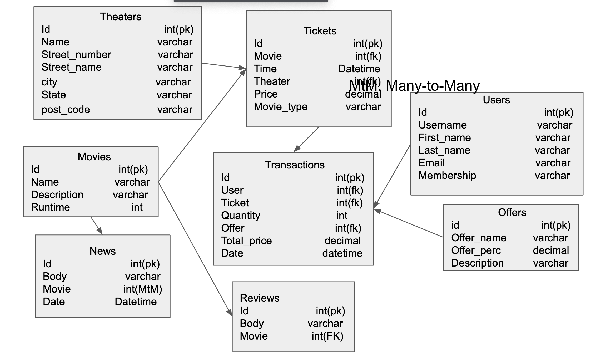

We created an admin account automatically as the server starts, some requests are restricted only to admins. This will be mentioned in the later as well.   
admin username: admin 
admin password: admin 

For every newly registered user, the default membership is normal. 
### Endpoints
* /main/theaters: refers to all theaters 
   * GET: list all theaters information to the template, including name, address, city, state, postal code, and a button to see all tickets each sells. Anyone can do this even without any authentification. Code sent: 200.  
   Example:  
   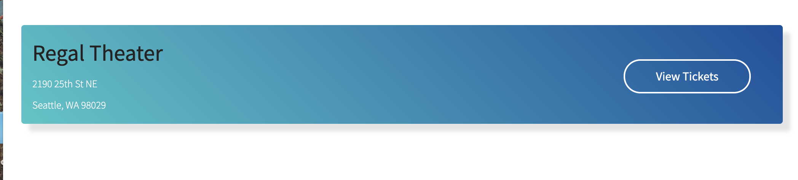
   * POST: Create a new theater, save it into the database using the theater model JSON in the request body, respond with a 201 code and a copy of the new theater model encoded as a json object. Only the administrator and the seller can do it. It may return Database error or KeyError messages.
   * Sample input: 
   { 
     "name": "regal", 
     "street_number": 123,  
     "street_name": "University way",  
     "city": "Seattle",  
     "state": "WA", 
     "post_code": "98105" 
   } 
   * Sample output: 
   { 
     "id": 2,  
     "name": "regal", 
     "street_number": 123,  
     "street_name": "University way",  
     "city": "Seattle",  
     "state": "WA", 
     "post_code": "98105" 
   }

* /main/theaters/{theater_id}: refers to a specific theater
   * GET: Respond with information of the specific theater as a json object with a status of 200. It will return Database error if bugs happen. Anyone can do this even without any authentification.
     * Sample input: 
    { 
      "name": "Regal Theaters", 
      "street_number": "1234",  
      "street_name": "Brooklyn Avenue",  
      "city": "Seattle",  
      "state": "WA",  
      "post_code": "98105"  
    } 

   * PATCH: modify information of the specific theater using the JSON object in the request body, save new changed into the database, respond with a 201 and a copy of the newly updated theater encoded as a json objet. Only the administrator and the seller can do it. It will return Database Error or KeyError messages when bugs happen.
     * Sample input: 
    { 
      "name": "amc", 
      "street_number": 133,  
      "street_name": "University of Washington way",  
      "city": "Seattl",  
    } 
    * Sample output: 
   { 
     "id": 1  
     "name": "amc", 
     "street_number": 133,  
     "street_name": "University of Washington way",  
     "city": "Seattl",  
   } 
   * DELETE: delete the specified channel in the database according to the parameter in the url and respond with a HttpResponse with 'deleted' if succeed. It may also return Database error message if there are errors in the code. Only the administrator and seller are authorized to do this.
  * Sample output: 
  "Deleted" 

* /main/theaters/{theater_id}/movies: refers to all movie played in the theater
  * GET: Respond with a list of all of the movies in the database that are played in the theater. code sent: 200. Any one can do this without any authentification.  
  Example:  
  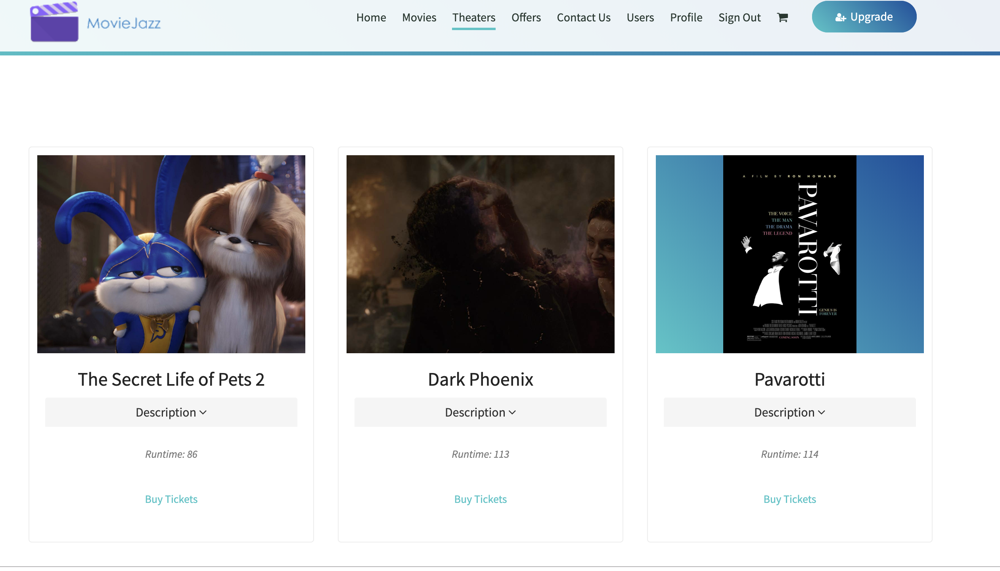

* theaters/{int:theater_id}/movies/{movie_id}/tickets: refers to all tickets of a movie in a specified theater
  * GET: List the ticket information, including show time, movie type, price, seats left. code sent: 200. Anyone can do this without any authentification 
  Example:  
  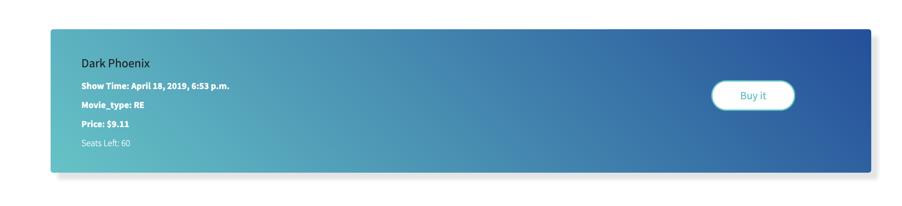
  * POST: post new tickets to the database according to the two parameters in the url and returns a json object if succeed. Only the administrator can do this. Code sent: 201
  * Sample input: 
   { 
     "time": "2019-04-18T18:53:12Z", 
     "price": 9.16,  
     "movie_type": "RE",  
     "amount": 60,  
   } 
  * Sample output:  
    {
    "id": 7,  
    "movie_id": 2,  
    "time": "2019-04-18T18:53:12Z",  
    "theater_id": 3,  
    "price": "9.16",  
    "amount": 60,  
    "movie_type": "RE"  
    }
  * DElETE: delete tickets of a specific movie in a specified theater and return with a plain http response"Ticket Deleted" if succeed. code sent: 201. Only the administrator can do this

* /main/transactions: refers to all tickets transactions of the currentuser in the Database
   * GET: Renders a list of all tickets transactions that the current user made before. Code sent, the user has to login to complete this operation.
   Example:  
   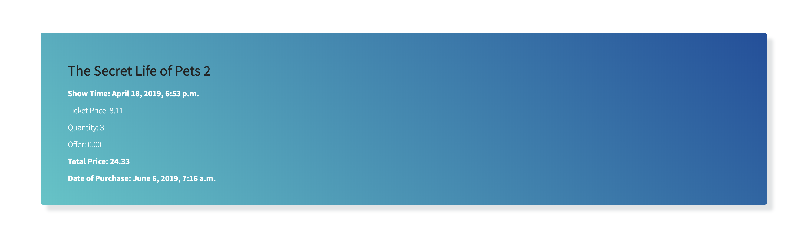
   * POST: Create a new transaction model, save it into the database using the transaction model JSON in the request body, respond with a 201 code and a copy of the new transaction encoded as a json objet. Only the administrator can do this action. It will return Database error message or KeyError message if something goes wrong.
   * Sample input: 
   { 
     "user": 1, 
     "ticket": 1,  
     "quantity": 3,  
     "offer": 1,  
   }
   * Sample output: 
   { 
     "id": 2,  
     "user": 1, 
     "ticket": 1,  
     "quantity": 3,  
     "offer": 1,  
     "total_price": 12.88,  
     "date": "2019-04-18T18:53:12Z" 
   }
   * DELETE: delete the specified ticket transaction in the database according to the JSON object in the request body. Respond witha  Http Response with 'delete' if succeed. It will return Database error message if there are errors in the code. Only the administrator can handle this action.
   * Sample input: 
     { 
       "id": 1 
     }
   * Sample output: 
   "transaction Deleted"
* /movies: refers to all movies in the Database
   * GET: List all movies and their related information, including name, short description, and runtime. Anyone can do this even without any authentification. Code snet: 200  
   Example:  
   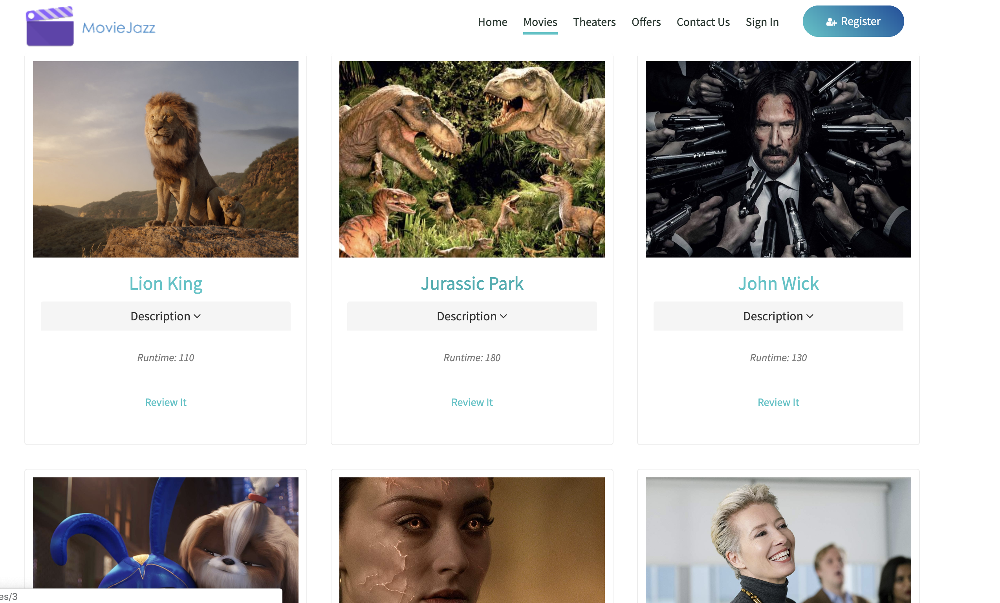
   * POST: Create a new movie, save it into the database using the movie model JSON in the request body, respond with a 201 code and a copy of the new movie encoded as a json object. Only the administrator can do it. It may return Database error message if something goes wrong.
   * Sample input: 
   { 
     "name": "Avengers:endgame",  
     "description": "This is Avengers",  
     "runtime": 120,  
   }
   * Sample output: 
   { 
     "id": 3
     "name": "Avengers:endgame",  
     "description": "This is Avengers",  
     "runtime": 120,  
   }
* /movies/{movie_id}: refers to a specific movie
   * GET:  Display information for a specified movie, including its name, runtime, and a review button if the user wants to rate it. Anyone can do this even without any authentification. code sent: 200 
   Example:  
   
   * PATCH: modify information of the specific movie using the JSON object in the request body, save new changed into the database, respond with a 201 and a copy of the newly updated movie encoded as a json objet. Only the administrator can do it. It will return Database Error or KeyError messages when bugs happen.
   * Sample input: :
   { 
     "name": "Lion King",  
     "description": "This is lions",  
   } 

   * Sample output: :
   { 
     "id": 2,
     "name": "Lion King",  
     "description": "This is lions",  
   } 

   * DELETE: delete the specified movie in the database according to the parameter in the url. Respond with a  Http Response with 'This movie was deleted' if succeed. It will return Database error message if there are errors in the code. Only the administrator can handle this action.
   * Sample output: :
   "Movie deleted" 

* movies/raw: refer all movies data in a json Response
  * GET: Retrieve all movie data form the database and return it as a json object. Code sent: 200, anyone can do this without authentification.
  Example:  
  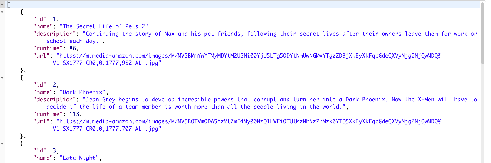

* movies/search: a user can search a movie in the database
  * GET: renders a search bar where user can type the movie he wants. code sent: 200. Anyone can do this without authentification.
  Example:  
  
  * POST: based on the query the user submits, finds all movies names that contains all leters of the user input and renders all movies. code sent: 200. Anyone can do this without any authentification.
  Example:  
  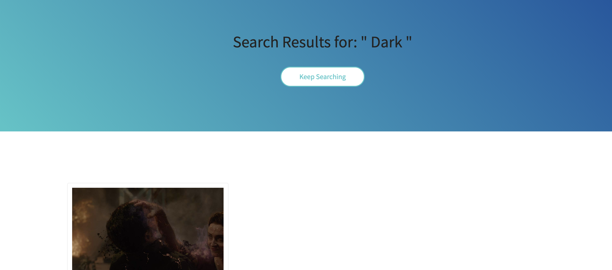

* movies/{movie_id}/review: allows the user to rate the movie specified in the url.
  * GET: renders a review form, where the user can rate the movie from terrible to excellent, and write his comments.
  Example:  
  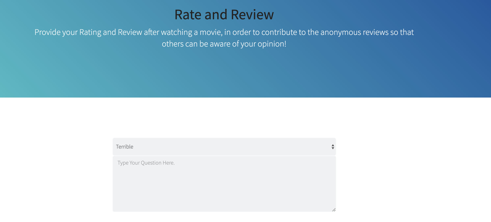
  * POST: Create a new review model and save it in the database based on what the user fill in the review-form. It will return a plain HttpResponse"Thanks for rating" if succeeds. code sent: 201. The user has to login to do this operation.

* /users: refers to all users in the Database
   * GET: Respond with a list of all of the users in the database with a status of 200. It will return Database error message if bugs happen. Only the administrator can do this.
   Example:  
   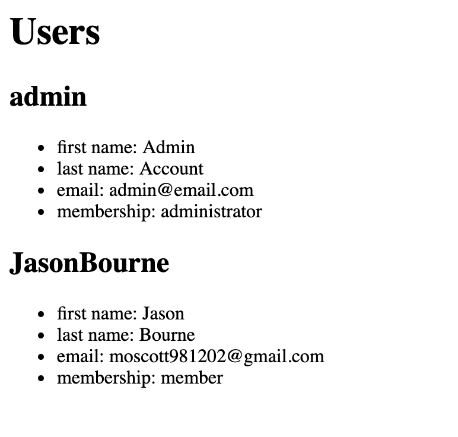

* /offers: refers to all offers in the database
   * GET: Respond with a list of all of the offers in the database with a status of 200. It will return Database error message if bugs happen. Anyone can do this even without any authentification.
   * POST: Create a new offer, save it into the database using the offer model JSON in the request body, respond with a 201 code and a copy of the new offer encoded as a json object. Only the administrator can do it. It may return Database error message if something goes wrong.
   * Sample input: 
   { 
     "offer_name": "30% off",  
     "offer_perc": 0.70,  
     "description": "this is an offer" 
   } 
   * Sample output: 
   { 
     "id": 2,  
     "offer_name": "30% off",  
     "offer_perc": 0.70,  
     "description": "this is an offer" 
   } 

* /offers/{offer_id}: refers to a specific offer
   * GET: Respond with information of the specific offer as a json object with a status of 200. It will return Database error if bugs happen. Anyone can do this even without any authentification.
   * PATCH: modify information of the specific offer using the JSON object in the request body, save new changed into the database, respond with a 201 and a copy of the newly updated offer encoded as a json objet. Only the administrator can do it. It will return Database Error or KeyError messages when bugs happen.
   * Sample input: :
   { 
     "offer_name": "30% off",  
     "description": "this is an offer" 
   } 
   * Sample output: :
   { 
     "id": 3,  
     "offer_name": "30% off",  
     "description": "this is an offer" 
   } 
   * DELETE: delete the specified offer in the database according to parameter in the url. Respond with a  Http Response with 'This offer was deleted' if succeed. It will return Database error message if there are errors in the code. Only the administrator can handle this action.
   * Sample output: :
   "Offer deleted" 

* contact/
  * GET: renders a form, where the user can fill their first name, last name, email, the question and choose which type of question they want to ask. Anyone can do this even without any authentification. code sent: 200.  
  Example:  
  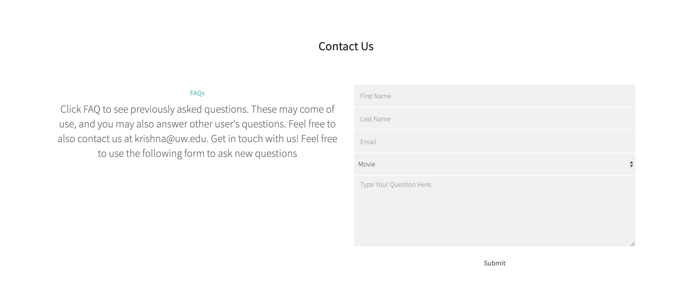
  * POST: Post the question the users asked into the data. If succeeds, the system will respond with a HttpResponse 'Thank you for posting questions.' code sent: 201.  
  Example:  
  

* contact/questions/
  * GET: List all questions users posted and their answers. Some have been provided answers, and some have not. code sent: 200. Anyone can do this even without any authentification, but only the administrator can see the 'procide answer' button 
  Example:  
  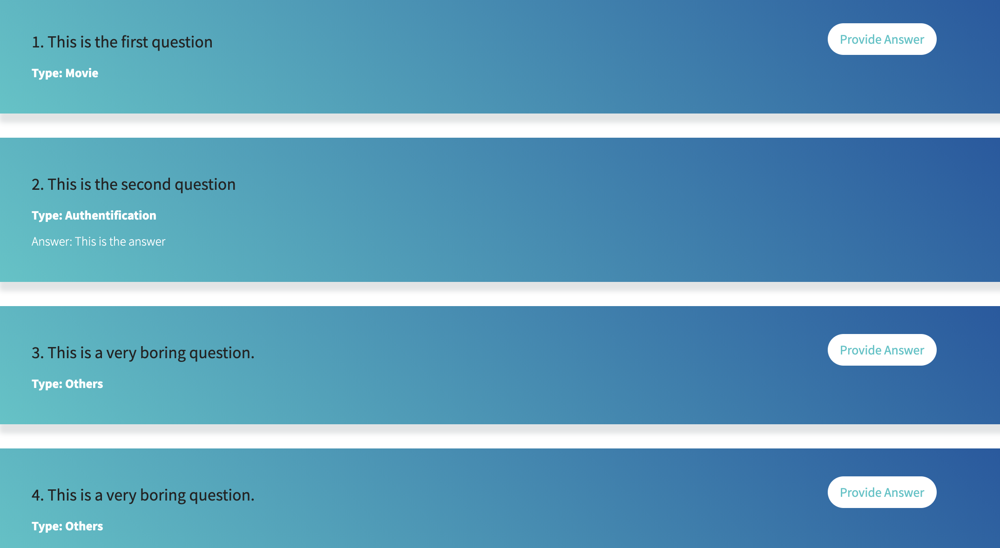

* contact/answer/{question_id}/
  * GET: renders a form, where the administrator can answer the question specified in the url. code sent: 200. Only the administrator can do this. code sent: 200 
  * Post: The new answer will be stored in the database. If succeeds, the system will reply with HttpResponse: 'Thank you for answering'. code sent: 201. Only the administrator can do this.  

* auth/signin/
  * GET: renders a signin form, where the user needs to fill his username and password. code sent; 200. Anyone can do this without any authentification.  
  Example:  
  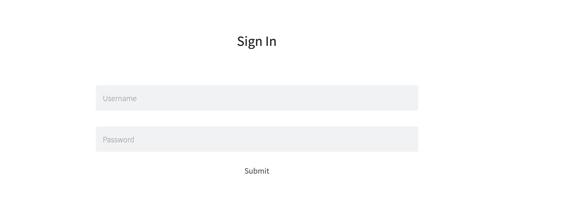
  * POST: If the filled username exists in the database and the password matches. the server will allow the user to login and redirect to the homepage.

* auth/register
 * GET: renders a registration form, where the user needs to fill his username, password, password comfirmation, fist name, last name, and email to sign up a new account. code sent: 200. Anyone can do this without any authentification.  
 Example:  
 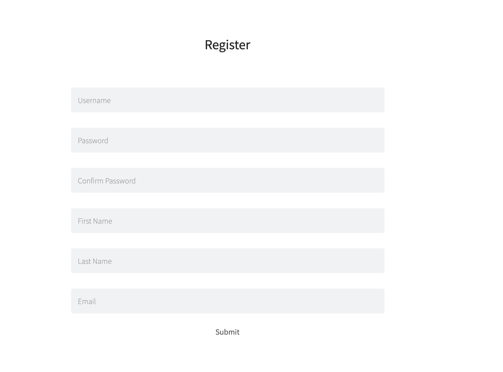
 * POST: Post the new user data to the database if the user fills all data appropriately and redirect to the signin form. code sent: 201. Anyone can do this without any authentification.  

 * user/
   * GET: list all data profile that the user current has. code sent: 200. The user has to login to do this operation. 
   Example:  
   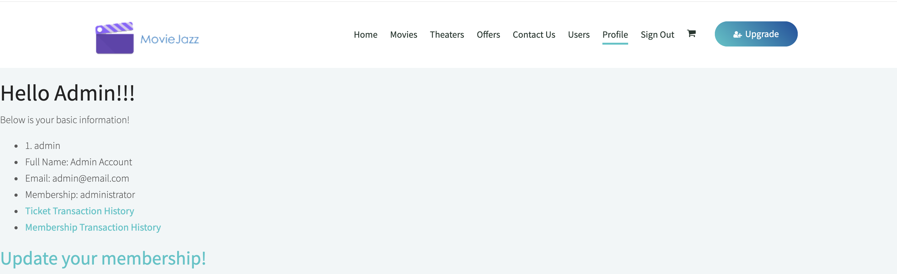

* user/memberships: list all membership options
  * GET: list all membership options that the user can buy. code sent: 200. The user has to login to this operation.
  Example:  
  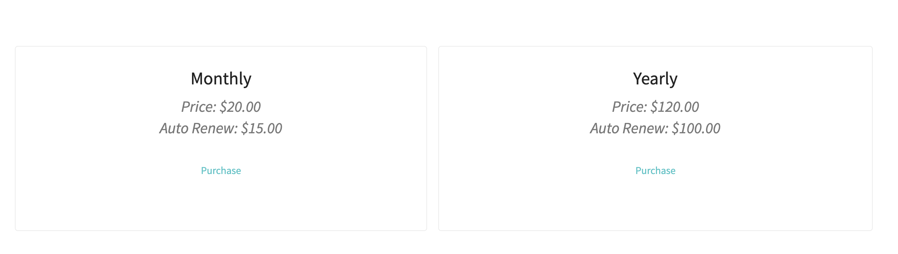

* 'user/memberships/purchase/<int:theType>': allows user to buy a specified membership based on the url
  * GET: renders a list where user can fill all of his information to update the membership.  
  Example:  
  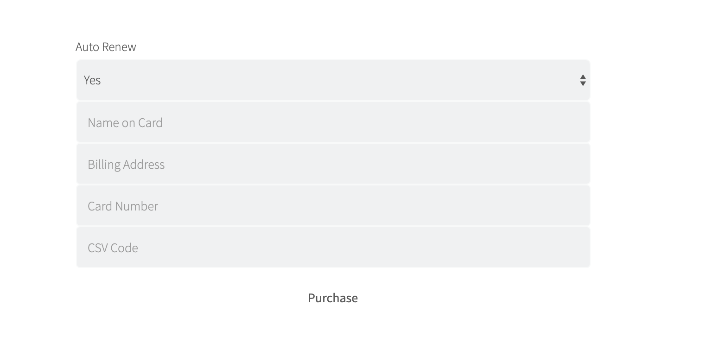
  * POST: create a new membership transaction model and save it into the database. Reply with a plain HttpResponse if succeed("Thanks for purchasing")code sent: 201. The user has to login to do this. 

* user/transactions: refers to all membership transaction of the current user
  * GET: renders a list of all membership transaction. code sent:200. The suer has to login to do this.
  Example:  
  

* cart/
  * GET: display all items(tickets) that the user intends to buy, for each item, it displays its id, quantity, movie name, offer name, total_price. code sent: 200. The user has to login to do this operation.
  Example:  
  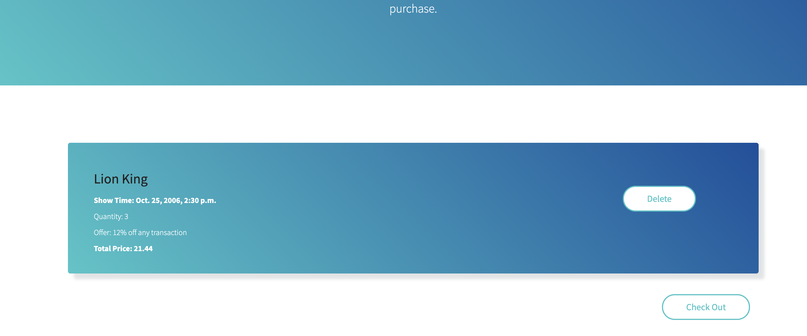

* cart/<int: cart_id>
  * GET:

* cart/checkout
  * GET: renders a checkout form when the user plans to pay for all items in his cart. The users neess to fill name_on_card, billing_address, card_number and csv code to finish this purchase. code sent: 200.  The user has to be authenticated to do this operation.
  * POST:
