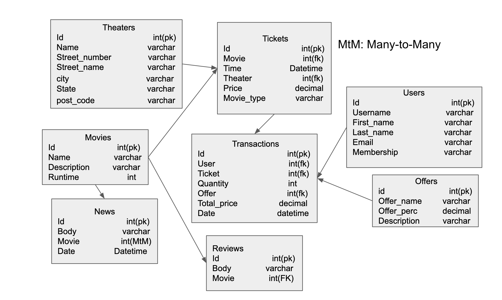

# movieJazz

We created an admin account automatically as the server starts, some requests are restricted only to admins. This will be mentioned in the later as well.   
admin username: admin 
admin password: admin 

For every newly registered user, the default membership is normal. 
### Endpoints
* /main/theaters: refers to all theaters 
   * GET: Respond with a list of all of the theaters in the database with a status of 200. It will return Database error message if bugs happen. Anyone can do this even without any authentification.
   * POST: Create a new theater, save it into the database using the theater model JSON in the request body, respond with a 201 code and a copy of the new theater model encoded as a json object. Only the administrator and the seller can do it. It may return Database error or KeyError messages.
   * Sample input: 
   { 
     "name": "regal", 
     "street_number": 123,  
     "street_name": "University way",  
     "city": "Seattle",  
     "state": "WA", 
     "post_code": "98105" 
   } 
   * Sample output: 
   { 
     "id": 2,  
     "name": "regal", 
     "street_number": 123,  
     "street_name": "University way",  
     "city": "Seattle",  
     "state": "WA", 
     "post_code": "98105" 
   }
* /main/theaters/{theater_id}: refers to a specific theater
   * GET: Respond with information of the specific theater as a json object with a status of 200. It will return Database error if bugs happen. Anyone cna do this even without any authentification.
   * PATCH: modify information of the specific theater using the JSON object in the request body, save new changed into the database, respond with a 201 and a copy of the newly updated theater encoded as a json objet. Only the administrator and the seller can do it. It will return Database Error or KeyError messages when bugs happen.
   * Sample input: 
  { 
    "name": "amc", 
    "street_number": 133,  
    "street_name": "University of Washington way",  
    "city": "Seattl",  
  } 
   * DELETE: delete the specified channel in the database according to the parameter in the url and respond with a HttpResponse with 'deleted' if succeed. It may also return Database error message if there are errors in the code. Only the administrator and seller are authorized to do this.
  * Sample output: 
  "Deleted" 

* /main/theaters/{theater_id}/tickets: refers to all movie tickets in the theater
   * GET: Respond with a list of all of the tickets in the database that belong to the current user with a status code of 200. If something goes wrong, it will reply Database Error. Every user can do this after authentification
   * POST: Create a new ticket, save it into the database using the ticket model JSON in the request body, respond with a 201 code and a copy of the new ticket encoded as a json object. Only the administrator and the seller can do it. It may return Database error message or KeyError message if something goes wrong.
   * Sample input: 
   { 
     "movie": 1, 
     "time": "2019-04-18T18:53:12Z",  
     "price": "18.6",  
     "movie_type": "RE" 
   }
   * Sample output: 
   { 
     "id": 2,  
     "movie": 1,  
     "time": "2019-04-18T18:53:12Z",  
     "theater": 1,  
     "price": "18.6",  
     "movie_type": "RE" 
   }
   * DELETE: delete the specified ticket in the database according to the JSON object in the request body. Respond with a HttpResponse with 'deleted' if succeed. It will return Database error message if there are errors in the code. Only the administrator can handle this action.
   * Sample output: 
   "Ticket Deleted"
* /main/transactions: refers to all transactions in the Database
   * GET: Respond with a list of all of the tickets in the database witha  status code of 200. If something goes wrong, it reply with a Database Error Message. Only the administrator can use this route.
   * POST: Create a new transaction model, save it into the database using the transaction model JSON in the request body, respond with a 201 code and a copy of the new transaction encoded as a json objet. Only the administrator can do this action. It will return Database error message or KeyError message if something goes wrong.
   * Sample input: 
   { 
     "user": 1, 
     "ticket": 1,  
     "quantity": 3,  
     "offer": 1,  
   }
   * Sample output: 
   { 
     "id": 2,  
     "user": 1, 
     "ticket": 1,  
     "quantity": 3,  
     "offer": 1,  
     "total_price": 12.88,  
     "date": "2019-04-18T18:53:12Z" 
   }
   * DELETE: delete the specified transaction in the database according to the JSON object in the request body. Respond witha  Http Response with 'delete' if succeed. It will return Database error message if there are errors in the code. Only the administrator can handle this action.
   * Sample input: 
     { 
       "id": 1 
     }
   * Sample output: 
   "transaction Deleted"
* /movies: refers to all movies in the Database
   * GET: Respond with a list of all of the movies in the database with a status of 200. It will return Database error message if bugs happen. Anyone can do this even without any authentification.
   * POST: Create a new movie, save it into the database using the movie model JSON in the request body, respond with a 201 code and a copy of the new movie encoded as a json object. Only the administrator can do it. It may return Database error message if something goes wrong.
   * Sample input: 
   { 
     "name": "Avengers:endgame",  
     "description": "This is Avengers",  
     "runtime": 120,  
   }
   * Sample output: 
   { 
     "id": 3
     "name": "Avengers:endgame",  
     "description": "This is Avengers",  
     "runtime": 120,  
   }
* /movies/{movie_id}: refers to a specific movie
   * GET: Respond with information of the specific movie as a json object with a status of 200. It will return Database error if bugs happen. Anyone can do this even without any authentification.
   * PATCH: modify information of the specific movie using the JSON object in the request body, save new changed into the database, respond with a 201 and a copy of the newly updated movie encoded as a json objet. Only the administrator can do it. It will return Database Error or KeyError messages when bugs happen.
   * Sample input: :
   { 
     "name": "Lion King",  
     "description": "This is lions",  
   } 

   * Sample output: :
   { 
     "id": 2,
     "name": "Lion King",  
     "description": "This is lions",  
   } 

   * DELETE: delete the specified movie in the database according to the parameter in the url. Respond with a  Http Response with 'This movie was deleted' if succeed. It will return Database error message if there are errors in the code. Only the administrator can handle this action.
   * Sample output: :
   "Movie deleted" 

* /users: refers to all users in the Database
   * GET: Respond with a list of all of the users in the database with a status of 200. It will return Database error message if bugs happen. Only the administrator can do this.

* /offers: refers to all offers in the database
   * GET: Respond with a list of all of the offers in the database with a status of 200. It will return Database error message if bugs happen. Anyone can do this even without any authentification.
   * POST: Create a new offer, save it into the database using the offer model JSON in the request body, respond with a 201 code and a copy of the new offer encoded as a json object. Only the administrator can do it. It may return Database error message if something goes wrong.
   * Sample input: 
   { 
     "offer_name": "30% off",  
     "offer_perc": 0.70,  
     "description": "this is an offer" 
   } 
   * Sample output: 
   { 
     "id": 2,  
     "offer_name": "30% off",  
     "offer_perc": 0.70,  
     "description": "this is an offer" 
   } 

* /offers/{offer_id}: refers to a specific offer
   * GET: Respond with information of the specific offer as a json object with a status of 200. It will return Database error if bugs happen. Anyone can do this even without any authentification.
   * PATCH: modify information of the specific offer using the JSON object in the request body, save new changed into the database, respond with a 201 and a copy of the newly updated offer encoded as a json objet. Only the administrator can do it. It will return Database Error or KeyError messages when bugs happen.
   * Sample input: :
   { 
     "offer_name": "30% off",  
     "description": "this is an offer" 
   } 
   * Sample output: :
   { 
     "id": 3,  
     "offer_name": "30% off",  
     "description": "this is an offer" 
   } 
   * DELETE: delete the specified offer in the database according to parameter in the url. Respond with a  Http Response with 'This offer was deleted' if succeed. It will return Database error message if there are errors in the code. Only the administrator can handle this action.
   * Sample output: :
   "Offer deleted" 
